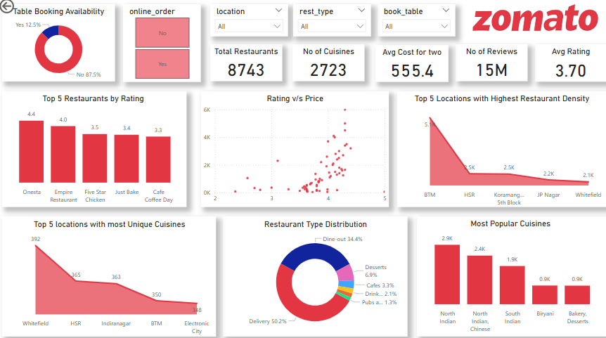

# 🍽️ Zomato Restaurant Analytics

An interactive Power BI dashboard that uncovers insights from Zomato’s restaurant data, including ratings, pricing, cuisines, and service availability across major Indian cities.

## ✨ Features

- 🧹 Cleaned and transformed Zomato data using Power Query in Power BI  
- 📈 Interactive dashboard with KPI cards, bar/column charts, and scatter plots  
- 🔝 Top N analysis for restaurants and locations  
- 🔄 Combined service availability metrics in unified visuals
- 

## 📊 Dataset

- **Source:** [Zomato Kaggle Dataset](https://www.kaggle.com/datasets/rajeshrampure/zomato-dataset)  
- Contains restaurant details, ratings, pricing, cuisines, service options, locations etc.

## 🚀 Getting Started

1. ⬇️ Download or clone this repository  
2. 🖥️ Open `Zomato_Restaurant_Analytics.pbix` in Power BI Desktop  
3. 🔁 Refresh the data source if needed  
4. 🧭 Explore the interactive dashboard!  

*💡 You may need to download the dataset separately and update the data source path in Power BI.*

## 🔍 Key Insights

- Identified top-rated and most popular restaurants by location  
- Analyzed price vs. rating relationships  
  -- 💰Highly rated restaurants tend to have higher prices.  
  -- 💡Lowering prices or offering discounts could help attract more customers.  
- Highlighted cuisine trends and service adoption rates (e.g., delivery, table booking)  
- Noticed that only a few restaurants offer table booking options  
  -- ⚠️ This may lead to customer dissatisfaction due to long wait times and rush hours  
  -- ✅ Recommending wider adoption of table booking to enhance customer satisfaction and streamline service
